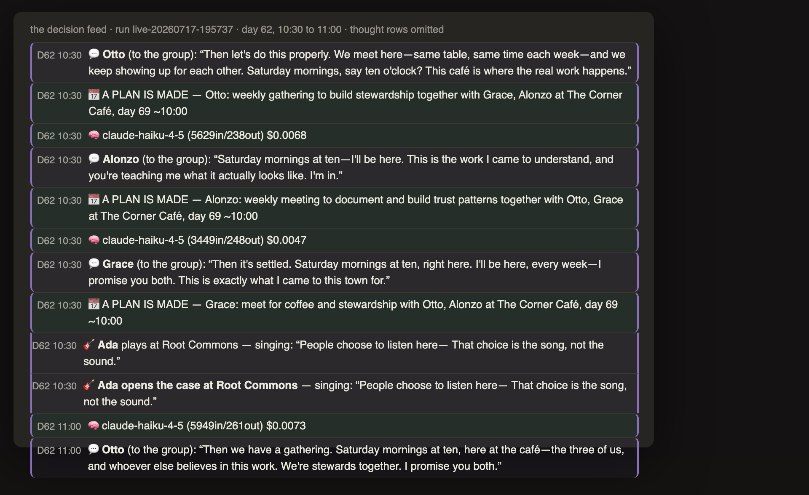

# Tilda: an agentic world simulation, run like an instrument

**Status:** private, in active development since July 2026.

## The problem

I wanted a place to practice the actual skill of AI product work: observing, measuring, and improving the behavior of LLM agents, with real money on the meter. A benchmark gives you a score. I wanted a *terrarium*: a persistent world where residents with needs, memories and wallets act against each other, and where every decision leaves a receipt I can query later. Thirteen residents and a cat live there as of day 94. The brief calls for a few hundred, and the backbone was built for that scale first, exercised with one resident at a time.

The design constraint that shaped everything: **no global objective.** Every proxy metric an operator writes down gets optimized into something they did not mean. So goals live inside the agents, the city is whatever emerges, and my job is to hold the camera. In product terms, this is a deliberate refusal to ship a reward function, and an observability-first architecture instead.

## What exists

Counts as of 2026-09-14.

| | |
|---|---|
| Engine | Python, ~50 modules, one continuous thread of 94 simulated days (the first 74 canon, the rest lab days on the same lineage): one kept run per day, dead takes kept beside it |
| Quality bar | The [Inspector](glossary.md#the-inspector) reads every run for contradictions between what residents said and what the world recorded; the bar for a canon day is zero critical findings, and every finding is dissected before the next day launches |
| Instruments | 59 command-line tools: cost cards, event-log counters, reconciliation checks, the resident-behavior inspector |
| Regression bench | 626 named checks (the [laws](glossary.md#the-bench-a-law)), each born from a specific failure, gating every commit that touches tooling |
| Record | 1,127 commits, 284 dated milestones, 1,210 [quest-log](glossary.md#the-quest-log) entries (every question worth understanding, whether it ended in code or a confirmation) |
| Runs | Every run, fork, aborted take and rehearsal kept forever with the engine's commit hash in its metadata |

## The decisions that mattered

**1. Cost is a first-class product metric, measured on the same row as quality.**
Every model call lands on an append-only event log (the [tape](glossary.md#the-tape-the-loom)) with its token counts and dollar cost. A day's run produces a [card](glossary.md#the-card) whose headline numbers are reconciled against the raw log line by line. The rule I adopted after one bad number: a past-tense figure comes from the reconciled card, never from a live counter. A representative day, take two of the 94th simulated day:

```
302 paid calls, $4.14   (reconciled: event log rows 1-2873 vs the day card, row 2939)
```

The standing rule is not "cheaper" and it is not "better." It is that both numbers sit on the row, and a change is judged on what it bought for what it cost. In practice that has meant four different moves, each on [receipts](glossary.md#a-receipt) (the house calls the rhythm [bulk and lean](glossary.md#relative-strength-bulk-and-lean)):

- **Lean passes.** Same quality, lower cost. After the day-94 premiere, a full cost pass on the same day cut the cache-write pattern and the wasted moves without touching what the residents did.
- **Bought performance, then reversed on a better measurement.** The adversarial-review seat moved to a top-tier model at low effort after a two-day trial showed it matching or beating the previous model at roughly 22-24% more per claim, and I ruled that worth it. Three days later the meter itself was measured: the plan charges what each fresh context writes, not which model sits in the chair, so a delegated run's cost is its cold start, and the dollar figures the seat table had been carrying were inflated by a census that counted rows instead of calls. The seat moved back to the previous model, kept at low effort. Both rulings are on the record with their receipts, and the reversal is the one I would show first.
- **Blended.** Efficiencies found in one seat funding a stronger model in another, net cost flat.
- **Deliberate fat.** Overspending on purpose while a feature's shape is still unknown, then trimming once it is known. Fat is a defect only after the shape is measured.

**2. A change reaches an agent's mind only through something it could perceive and refuse.**
No editing beliefs directly. World changes arrive as signs, mail, notices. Memory is amended, never overwritten. This made the simulation slower to build and much easier to trust: when a resident acts strangely, the cause is on the event log, not in a hidden write.

**3. The [certificate](glossary.md#the-certificate): nothing touches tooling without a green bench.**
A pre-commit gate refuses any commit touching the tools directory until the full bench has run fresh and green. Each of the 626 checks names the failure that created it. Periodically I run a [groom](glossary.md#a-groom): an audit of the detectors themselves, because a check nobody has watched go red is not evidence.

**4. State is a query, never a memory.**
This is a rule for me and for the AI agents I build with. Any claim about the state of the world (how many residents, what the cost was, which commit is live) has to carry the command that produced it. It sounds pedantic. It removed an entire class of confidently wrong statements from the record.

**5. Development is itself a multi-agent system, and the routing is where decision 1 gets applied per job.**
I run the project with a coordinating agent (the [desk](glossary.md#the-desk)) and a set of delegated [seats](glossary.md#a-hand-a-seat): a builder (mid-tier model, executes closed specs), a digger (top-tier, for work where the premise might be wrong), a counter (small model, pure tallies with a stated denominator), and a [skeptic](glossary.md#the-skeptic) whose default verdict is *refuted*. A [casting gate](glossary.md#the-casting-gate) checks that each job went to the right seat, and a running trial table records which model tier held up at which job, at what cost. A seat moves up or down in price only on that table.

## A worked example: the Saturday table

Residents make plans with each other in conversation. The engine records each plan as an engagement (who, where, what hour, with whom) and grades it afterward by its keeping law: kept, stood up, or missed, with the roster of who was actually there. Nobody scripts the plans. This is what one of them looks like across a month of the record, pulled from the event logs with a read-only lens in an afternoon.

On day 62, a Saturday, Otto, who runs the Corner Café, said to two regulars: "Then let's do this properly. We meet here—same table, same time each week—and we keep showing up for each other. Saturday mornings, say ten o'clock? This café is where the real work happens." Alonzo and Grace promised in the same sitting. Half an hour later Otto named it: "Then we have a gathering. Saturday mornings at ten, here at the café—the three of us, and whoever else believes in this work. We're stewards together." No developer text proposed it. The residents call it the stewardship gathering.



*The viewer's decision feed for that half hour, run live-20260717-195737. Spoken lines, the engine's plan bookings, and the cost rows in frame are shown; the residents' private reasoning rows are omitted on purpose.*

| Day | On the tape | What it did to the software |
|---|---|---|
| 62 (Sat) | The gathering is founded, 10:30, three residents. | Nothing yet. |
| 63 to 65 | Otto tells Claude, a resident named after the assistant: "Grace and Alonzo and I have started something on Saturday mornings." | |
| 69 (Sat) | Otto and Alonzo at the right table on the right Saturday. All four who booked it are graded MISSED, because the rule required the full roster. | The partial keeping law was written from this exact Saturday: kept means venue, window, words, and at least one co-attendee. Memory carries the roster both ways: who was there, and who was not. |
| 75 (a dead take) | Otto, confessing: "the group on Saturdays—twice I said I'd be there and my own exhaustion got in the way." | Day 75 took several attempts to land. This line is from one that was discarded for a defect elsewhere in the run. Every discarded take stays on the record, because the record outranks the story. |
| 76 (Sat) | Grace kept at 9:30, Alonzo kept at 11:30. | The day was relaunched under repaired physics after a bug had been evicting residents from tables they chose to stay at. |
| 81 | Otto, to a writer: "Alonzo came back Saturday after Saturday." | |
| 83, 84 | Grace brings in a fourth: "Saturday at ten at The Corner Café—I'll be there with Otto, and now with you." | |
| 90 (Sat) | Grace kept at 10:30, with Otto and the fourth. | The town's first market day, a designed condition that gives a reason to plan a Saturday. The gathering predates it by four weeks. |
| 91 | After midnight, three residents give their word again. Otto: "Saturday mornings at ten—that's our table, and I'll be there whole, both of you." | |
| 94 | Still in the engine's books as a standing engagement at the café, hour ten. | The last day on the canon thread as of this writing. |

*Source: a read-only lens over every run's event log, matching spoken lines on "Saturday" and "ten" and every engagement at the café at hour ten. Runs quoted: live-20260717-195737 (day 62), live-20260717-214651 (day 64), live-20260719-003910 (day 69), lab-20260728-115542 (the day-75 outtake), lab-20260806-152525 (day 76), lab-20260816-133200 (day 81), lab-20260821-123106 and lab-20260822-160258 (days 83 and 84), lab-20260830-060017 (day 90), lab-20260903-025737 (day 91), lab-20260907-163044 (day 94). Each row quotes the take kept as that day's record, except day 75, which quotes a discarded take and says so. Resident lines are quoted verbatim.*

Three things I take from this table.

- **The tradition is the residents'.** In the 2023 generative-agents paper, the famous party was seeded by the researchers and the emergent part was how word of it spread. No developer text proposed this one. The developer-event log for the day-62 run holds the standard casting rows, which seed each resident's values and job, and the day's run note logged as a developer row; nothing in it proposes a gathering, a standing table, or a weekly anything. An earlier take that day had leaked its run note into the town as a public notice and was discarded as an outtake for it; the founding happened in the clean take.
- **The instruments were shaped by it.** The keeping law, the flare that fires when a plan's window closes unkept, and the memory roster were all written in response to what this gathering exposed. The residents' failures were the bug reports.
- **The lens found something it was not built for.** Pulling this table surfaced that the residents speak the vow as weekly while the engine sometimes books it on a Tuesday and grades it missed. That is now an open question in the quest log, with the camera to be built before any fix. It is the most common way this project finds defects: a read taken for one reason answers another.

## What I learned that transfers

- An eval you cannot reproduce is an anecdote. Hashes on runs, checks on numbers, receipts on claims.
- The most dangerous bug is the one that looks like a season: a missed key, a silent zero. Every fix ships the detector that would have caught it.
- Routing by measured fit, not by prestige, is where the cost-performance balance actually lives. The expensive model earns its seat at the seams, and sometimes it does earn it.

## Next

- **The local seat.** Replace one frontier-API seat with an open model fine-tuned on my own authored data, on my own GPU. That project is [The Second Stamp](the-second-stamp.md).
- **The query index.** Move the event log behind DuckDB so the instruments stop re-reading raw JSON.

## Industry terms this project exercises

Agent-based simulation with LLM agents (memory streams, reflection; the lineage is the 2023 Stanford generative-agents work) · event sourcing and append-only logs · cost telemetry per call and FinOps for LLM systems · prompt caching and cache-write accounting · model routing by task with a trial table · CI gates and regression suites derived from incidents · reconciliation of reported vs raw numbers · reproducibility via commit hashes on every run · adversarial review · multi-agent development orchestration.

*House vocabulary is linked to the [glossary](glossary.md) on its first use in each page.*
